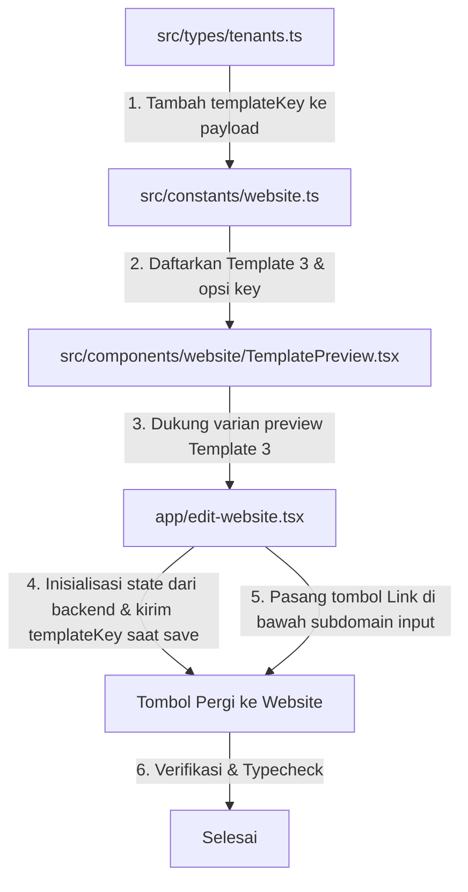

# Rencana Implementasi: Pemilihan Template Website (Template 1 & 3), Pengiriman `templateKey`, dan Tombol "Pergi ke Website"

## 1. Analisis Status Saat Ini

Berdasarkan pemeriksaan kode di `app/edit-website.tsx`, `src/types/tenants.ts`, `src/services/tenantService.ts`, dan `src/constants/website.ts`:

1. **Pengiriman `templateKey` ke Backend:**
   - **Saat ini BELUM dikirim**: Pada fungsi `handleSave()` di `app/edit-website.tsx`, request payload ke `updateLandingConfig` belum menyertakan properti `templateKey`.
   - **Type definition**: Tipe `UpdateLandingConfigPayload` di `src/types/tenants.ts` belum memiliki definisi `templateKey?: string`.
   - **Inisialisasi Template**: Pada saat `loadLandingContent()`, data `templateKey` dari response backend (`response.content.templateKey` atau `response.tenant.templateKey`) belum dimuat ke dalam state `selectedTemplate`.
   - **Duplikasi Request**: Terdapat pemanggilan ganda `updateBranding({ primaryColor: bgColor })` berturut-turut pada `handleSave()`.

2. **Dukungan Template 1 & 3:**
   - Di `src/constants/website.ts`, saat ini hanya terdaftar **Template 1** (`orange-catalog` / `template-1`) dan **Template 2** (`template-two`). Template 3 belum terdaftar.
   - Di `src/components/website/TemplatePreview.tsx`, pratinjau hanya menangani varian `hero` dan `list`. Perlu penyesuaian agar Template 3 memiliki representasi preview yang jelas.

3. **Tombol "Pergi ke Website":**
   - Belum tersedia tombol pintas di bawah input field _Subdomain Showroom_ untuk langsung membuka website katalog publik (`https://[subdomain].otokas.co.id`).

---

## 2. Rincian Perubahan yang Akan Dilakukan

### A. Update Tipe Data & Service (`src/types/tenants.ts`)

- Tambahkan `templateKey?: string;` ke dalam `UpdateLandingConfigPayload` (dan `UpdateBrandingPayload` jika diperlukan).
- Pastikan interface `LandingContent` dan `Tenant` tetap selaras dengan response backend.

### B. Penambahan Definisi Template 3 & Normalisasi Key (`src/constants/website.ts`)

- Warna default, `badgeText`, `title`, `subtitle`, dan `showAddress`.
- Tambahkan mapping/helper untuk mencocokkan key dari backend (misal: `"orange-catalog"` / `"template-1"` / `"t-001"` ke Template 1, `"template-two"` / `"template-2"` ke Template 2 `"t-003"`.

### C. Pembaruan Komponen Pratinjau (`src/components/website/TemplatePreview.tsx`)

- Tambahkan dukungan varian/layout visual untuk Template 3 pada `CatalogTemplatePreview` (misalnya varian `"grid"` atau card visual khas Template 3).
- Pastikan prop `variant` atau `templateKey` diteruskan secara dinamis saat preview kecil di card pilihan maupun di live preview besar.

### D. Pembaruan Logika & UI (`app/edit-website.tsx`)

1. **Load Initial Template Key**:
   - Pada `useEffect` / `loadLandingContent`, baca `response.content.templateKey` atau `response.tenant.templateKey`.
   - Set `selectedTemplate` sesuai nilai dari backend (dengan fallback ke default jika kosong).
   - Sinkronkan warna dan field teks jika template diubah.

2. **Kirim `templateKey` ke Backend pada `handleSave`**:
   - Sertakan `templateKey: selectedTemplate` pada payload `updateLandingConfig`.
   - Hapus pemanggilan duplikat `updateBranding({ primaryColor: bgColor })`.

3. **Tambahkan Tombol "Pergi ke Website"**:
   - Letakkan tepat di bawah form input _Subdomain Showroom_.
   - Menggunakan ikon `ExternalLink` atau `Globe` dari `lucide-react-native`.
   - Hubungkan aksi klik dengan `Linking.openURL("https://" + subdomain.trim() + ".otokas.co.id")`.
   - Validasi: Jika subdomain kosong, tampilkan peringatan dialog `Alert.alert("Perhatian", "Subdomain showroom belum diisi.")`.

---

## 3. Langkah-Langkah Eksekusi

1. **Step 1:** Modifikasi `src/types/tenants.ts` untuk menambahkan `templateKey` pada `UpdateLandingConfigPayload`.
2. **Step 2:** Perbarui `src/constants/website.ts` untuk mendaftarkan Template 3 dan konfigurasi template.
3. **Step 3:** Perbarui `src/components/website/TemplatePreview.tsx` untuk mendukung rendering/preview Template 1, 2, dan 3.
4. **Step 4:** Perbarui `app/edit-website.tsx`:
   - Muat `templateKey` dari backend saat fetch awal.
   - Kirim `templateKey` saat submit form `handleSave`.
   - Tambahkan tombol "Pergi ke Website" di bawah input subdomain dengan handling `Linking.openURL`.
   - Bersihkan pemanggilan duplikat `updateBranding`.
5. **Step 5:** Jalankan typecheck / linter untuk memastikan tidak ada regresi atau error TypeScript.
